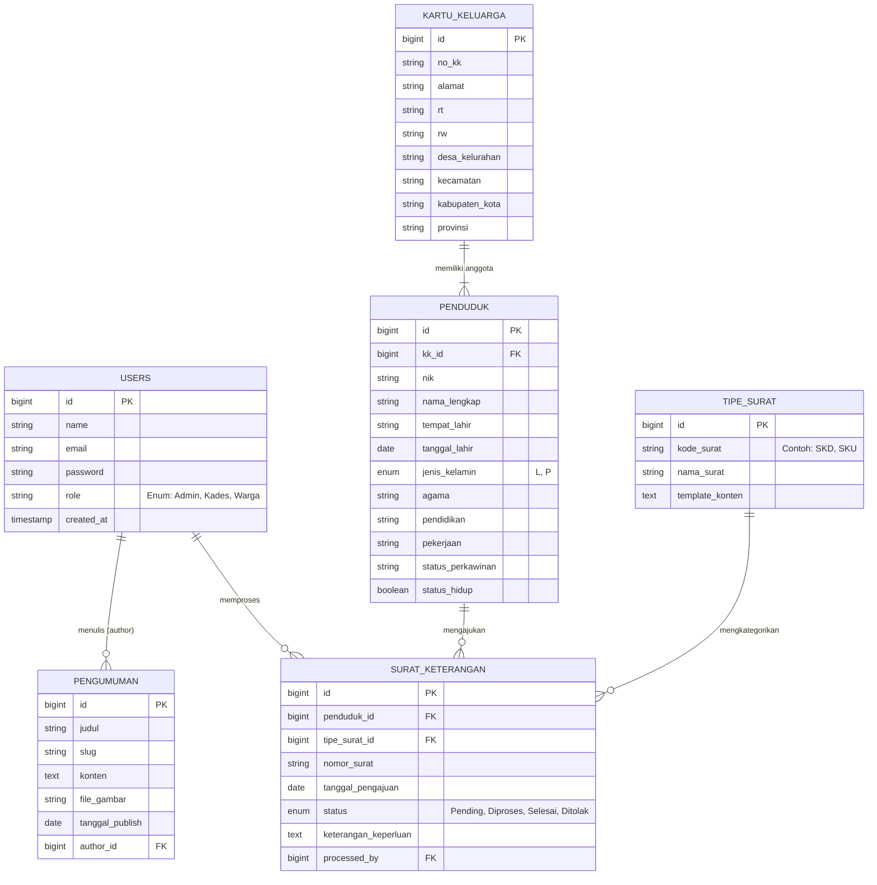

# Product Requirements Document (PRD)
**Proyek**: Sistem Administrasi Desa / Kelurahan (SIAS-Des)
**Dokumen**: PRD & Spesifikasi Teknis
**Penulis**: Antigravity (Senior Product Manager & Tech Lead)

---

## 1. Ringkasan Eksekutif
Sistem Administrasi Desa/Kelurahan (SIAS-Des) adalah platform berbasis web yang bertujuan untuk mendigitalisasi dan menyederhanakan proses pelayanan publik, pencatatan data penduduk, serta administrasi internal di tingkat desa atau kelurahan. Sistem ini dirancang agar mudah digunakan oleh perangkat desa serta mempermudah tata kelola data di era digital.

## 2. Tujuan Produk
- **Efisiensi Administratif:** Memangkas waktu dalam pencarian data kependudukan dan pembuatan surat keterangan.
- **Akurasi Data:** Memastikan data kependudukan (kelahiran, kematian, mutasi) selalu mutakhir (real-time).
- **Transparansi Layanan:** Memberikan status yang jelas terkait proses pengajuan layanan administrasi (misal: surat pengantar).
- **Digitalisasi Pengumuman:** Menjadi portal utama untuk penyebaran informasi dan pengumuman kepada masyarakat.

## 3. Persona Pengguna
1. **Admin / Perangkat Desa:**
   - Melakukan input, update, dan delete data penduduk & Kartu Keluarga (KK).
   - Memproses pengajuan surat keterangan (cetak dan verifikasi dokumen).
   - Mengelola berita, artikel, atau pengumuman desa.
2. **Kepala Desa / Lurah:**
   - Melihat dashboard statistik (demografi, jumlah penduduk, tren).
   - Melakukan *approval* atau penandatanganan surat secara sistem (opsional e-signature).
3. **Warga (Penduduk):**
   - Mengakses portal publik untuk melihat informasi desa.
   - (Fase Lanjutan) Bisa login untuk melacak atau mengajukan layanan mandiri.

## 4. Fitur Utama
- **Manajemen Kependudukan (CRUD):** 
  - Kelola Data Kartu Keluarga (KK).
  - Kelola Data Penduduk (Detail Individu: NIK, Nama, Pekerjaan, Pendidikan).
- **Layanan Persuratan (Mail Merge/Generator):**
  - Surat Keterangan Domisili, Surat Keterangan Usaha (SKU), Surat Pengantar SKCK, Surat Keterangan Tidak Mampu (SKTM).
- **Dashboard & Analitik:** 
  - Visualisasi data penduduk berdasarkan umur, jenis kelamin, dan pendidikan dalam bentuk chart.
- **Portal Informasi (CMS):**
  - Manajemen postingan/pengumuman desa yang dapat dilihat oleh publik.

---

## 5. Skema Data & Arsitektur

### 5.1 Penjelasan Naratif Arsitektur
Sistem ini menggunakan arsitektur **Monolitik** berbasis **Model-View-Controller (MVC)** yang memberikan keseimbangan terbaik antara kecepatan pengembangan dan kemudahan pemeliharaan (maintainability). 

* **Tech Stack:**
  - **Backend:** PHP menggunakan framework Laravel 11.
  - **Frontend:** Blade Templating Engine terintegrasi dengan template NiceAdmin (Bootstrap 5) untuk menjamin antarmuka yang responsif dan premium.
  - **Database:** SQLite (untuk development) atau MySQL/PostgreSQL (untuk environment Production).
  - **Autentikasi:** Laravel Breeze/Fortify (Sistem Session-based Authentication).

### 5.2 Penjelasan Naratif Skema Data
Database dirancang dengan pendekatan relasional (RDBMS) dengan beberapa entitas inti:
1. **`users`**: Tabel sentral untuk autentikasi sistem. Setiap akun akan memiliki *role* (Superadmin, Admin, Kepala Desa, Warga).
2. **`kartu_keluarga`**: Menyimpan data agregat per keluarga (Nomor KK, Alamat, RT/RW, Kepala Keluarga). Entitas ini merupakan *parent* dari penduduk.
3. **`penduduk`**: Menyimpan rincian data demografis (NIK, Nama, Tempat/Tanggal Lahir, Agama, Pekerjaan). Berelasi *Many-to-One* ke tabel `kartu_keluarga`.
4. **`tipe_surat`**: Tabel *master data* yang menyimpan format atau kategori surat yang disediakan desa.
5. **`surat_keterangan`**: Tabel transaksional (history). Setiap baris merekam warga (dari tabel `penduduk`) yang mengajukan surat (dari tabel `tipe_surat`), serta mencatat nomor urut surat, tanggal, dan status proses.
6. **`pengumuman`**: Entitas mandiri untuk konten publik, berelasi dengan `users` (sebagai penulis/author).

### 5.3 Visualisasi Entity Relationship Diagram (ERD)

## 6. Fase Rilis (Roadmap)
- **Fase 1 (MVP):** Autentikasi, CRUD Penduduk & KK, dan Dashboard Statistik Demografi dasar.
- **Fase 2:** Fitur Layanan Persuratan, Generator Surat otomatis berbasis template PDF/Word.
- **Fase 3:** Portal Warga, Sistem Pengumuman, dan fitur Pelaporan Mandiri bagi warga yang telah mendaftarkan akun.
